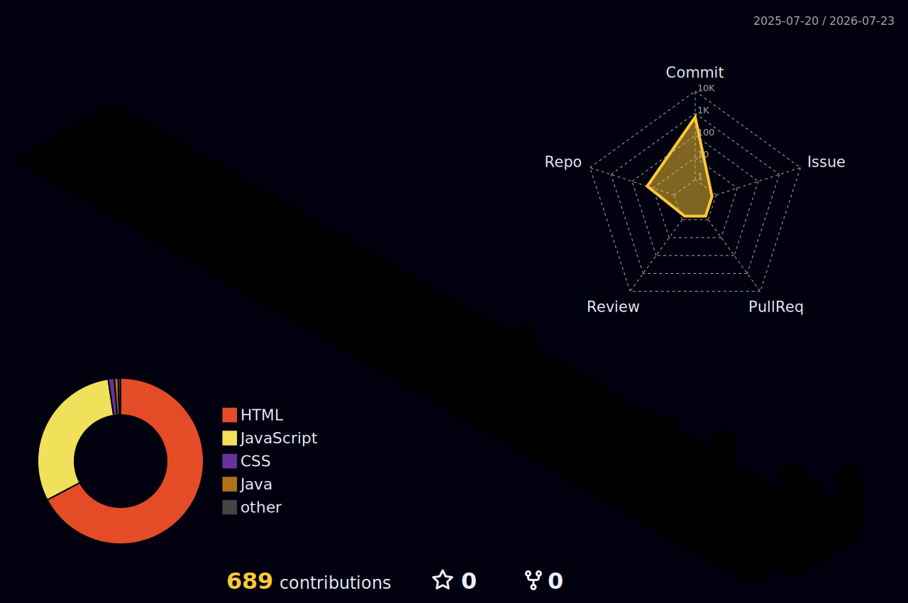

<!-- ================================================================ -->
<!-- KRISHIV PB — CYBERPUNK GITHUB PROFILE v4.0 · GODLY EDITION   -->
<!-- ================================================================ -->

<!-- Animated Wave Header -->

<!-- Dynamic Typing Subtitle -->

 

<!-- Typing Banner SVG Terminal -->

  

<!-- Social Badges -->

<!-- Profile Views & Stars & Followers -->

<i>&#9889; "Built to inspire. Built to dominate. Built by a Grade 7 Master Coder." &#9889;</i>

<!-- ========================================== -->
<!-- TROPHY SHELF                              -->
<!-- ========================================== -->

### &#127942; GitHub Trophy Shelf

<!-- ========================================== -->
<!-- CURRENTLY SECTION                         -->
<!-- ========================================== -->

### &#9889; Currently

| | |
|---|---|
| &#128301; | **Working on:** [Krishiv PB Portfolio](https://krishiv-new-portfoilo.vercel.app) — 100+ apps & tools |
| &#127793; | **Learning:** Advanced JavaScript, React, AI integrations |
| &#127919; | **2025 Goal:** Hit 500 contributions & launch 10 new projects |
| &#127918; | **Playing:** Asphalt 9 · Brawl Stars · Valorant |
| &#128172; | **Ask me about:** HTML, CSS, JS, Firebase, Vercel, AI tools |
| &#9889; | **Fun fact:** I started coding at age 10 and built 100+ web apps in one year! |

<!-- ========================================== -->
<!-- BENTO LAYOUT — Main Content               -->
<!-- ========================================== -->

<table>
<tr>
<!-- Left Column: Bio + Tech Stack + Status -->
<td width="50%" valign="top">

<h3>&#9889; System Profile</h3>

| | |
|---|---|
| &#127874; | **Age:** 11-year-old student developer |
| &#127757; | **Mission:** Bold web experiences & beyond |
| &#129309; | **AI Alliance:** Gemini + Antigravity agents |
| &#127919; | **Objective:** Expand the Krishiv PB universe |
| &#128161; | **Motto:** Try fast, build lean, refine always |
| &#9889; | **System Heartbeat:** <!--HEARTBEAT_STATUS-->Online (Last sync: 2026-07-06 19:13:42 UTC)<!--HEARTBEAT_STATUS_END--> |

 

<!-- Custom System Status Board -->

  

<!-- Custom Tech Stack Grid -->

  

<!-- GitHub Streak Stats -->

</td>

<!-- Right Column: Projects + Gaming + Stats -->
<td width="50%" valign="top">

<h3>&#128640; Featured Projects</h3>

| Project | What It Does |
|---|---|
| 🧠 [**Aether Core AI v110**](https://aether-core-ai-gilt.vercel.app) ([Repo](https://github.com/Krylo-60/Aether-core-v110)) | Standalone AI workspace with 12-node failover mesh |
| 📟 | [**Krims Code CLI**](https://www.npmjs.com/package/@krishivpb60/krims-code-cli) ([Repo](https://github.com/Krylo-60/krims-code-cli)) | Production-ready cyberpunk CLI assistant connecting 13+ AI providers globally |
| 🎛️ [**Master Nexus**](https://krishiv-new-portfoilo.vercel.app/krylo-blox-master-nexus.html) | High-density creator command center |
| &#127925; [**Phonk Room**](https://krishiv-new-portfoilo.vercel.app/phonk-room.html) | Canvas audio visualizer pulsing to Nitro Voltage |
| 🌌 [**Apps Galaxy**](https://krishiv-new-portfoilo.vercel.app/projects.html) | 100+ public pages & utility mini-apps |

 

<h3>&#127918; Gaming Console</h3>

  

<h3>&#128200; GitHub Telemetry</h3>

  

</td>
</tr>
</table>

<!-- ========================================== -->
<!-- PINNED REPO CARDS                         -->
<!-- ========================================== -->

### &#128204; Pinned Repositories

<!-- ========================================== -->
<!-- TECH ARSENAL — Skill Icons                -->
<!-- ========================================== -->

### &#128736; Tech Arsenal

<!-- ========================================== -->
<!-- ACHIEVEMENT BADGES                        -->
<!-- ========================================== -->

### &#127941; Achievement Badges

<!-- ========================================== -->
<!-- RANDOM DEV QUOTE                          -->
<!-- ========================================== -->

### &#128173; Random Dev Quote

<!-- ========================================== -->
<!-- RECENT SYSTEM ACTIVITY                     -->
<!-- ========================================== -->

### &#9889; Recent System Activity

<!--START_SECTION:activity-->
1. 🚀 Published release [v1.3.0 - Developer Slash Command Suite](https://github.com/Krylo-60/krims-code-cli/releases/tag/v1.3.0) in [Krylo-60/krims-code-cli](https://github.com/Krylo-60/krims-code-cli)
2. 🚀 Published release [v1.3.4 - AI Workspace Search](https://github.com/Krylo-60/krims-code-cli/releases/tag/v1.3.4) in [Krylo-60/krims-code-cli](https://github.com/Krylo-60/krims-code-cli)
3. 🚀 Published release [v1.3.5 - Web Telemetry Dashboard](https://github.com/Krylo-60/krims-code-cli/releases/tag/v1.3.5) in [Krylo-60/krims-code-cli](https://github.com/Krylo-60/krims-code-cli)
4. 🚀 Published release [v1.4.0 - Voice Commands & Nerd Fonts](https://github.com/Krylo-60/krims-code-cli/releases/tag/v1.4.0) in [Krylo-60/krims-code-cli](https://github.com/Krylo-60/krims-code-cli)
5. 🚀 Published release [v1.4.3 - Rate Limit Recognition](https://github.com/Krylo-60/krims-code-cli/releases/tag/v1.4.3) in [Krylo-60/krims-code-cli](https://github.com/Krylo-60/krims-code-cli)
<!--END_SECTION:activity-->

 

<!-- ========================================== -->
<!-- GIT ACTIVITY GRAPH                        -->
<!-- ========================================== -->

### &#128200; Git Activity Telemetry (31-Day Window)

<!-- ========================================== -->
<!-- CONTRIBUTION SNAKE                        -->
<!-- ========================================== -->

### &#128126; Contribution Matrix Snake

<picture>
  <source media="(prefers-color-scheme: dark)" srcset="https://raw.githubusercontent.com/Krylo-60/Krylo-60/output/github-contribution-grid-snake-dark.svg" />
  <source media="(prefers-color-scheme: light)" srcset="https://raw.githubusercontent.com/Krylo-60/Krylo-60/output/github-contribution-grid-snake.svg" />
  
</picture>

<!-- ========================================== -->
<!-- 3D CONTRIBUTION CALENDAR                  -->
<!-- ========================================== -->

### &#129475; 3D Contribution Calendar

<a href="https://github.com/yoshi389111/github-profile-3d-contrib">
<picture>
  <source media="(prefers-color-scheme: dark)" srcset="./profile-3d-contrib/profile-night-rainbow.svg" />
  <source media="(prefers-color-scheme: light)" srcset="./profile-3d-contrib/profile-green-animate.svg" />
  
</picture>
</a>

 

<!-- ========================================== -->
<!-- SYSTEM SOUNDTRACK                          -->
<!-- ========================================== -->

### &#127925; Now Vibing: System Soundtrack

<i>Click the badge to play the theme song on the live dashboard!</i>

 

<!-- ========================================== -->
<!-- ANIMATED WAVE FOOTER                      -->
<!-- ========================================== -->

 
🌐 System active since 2024 · Designed with &#9889; by <b>Krishiv PB</b> &amp; AI Agents · Built different &#128640;
  

